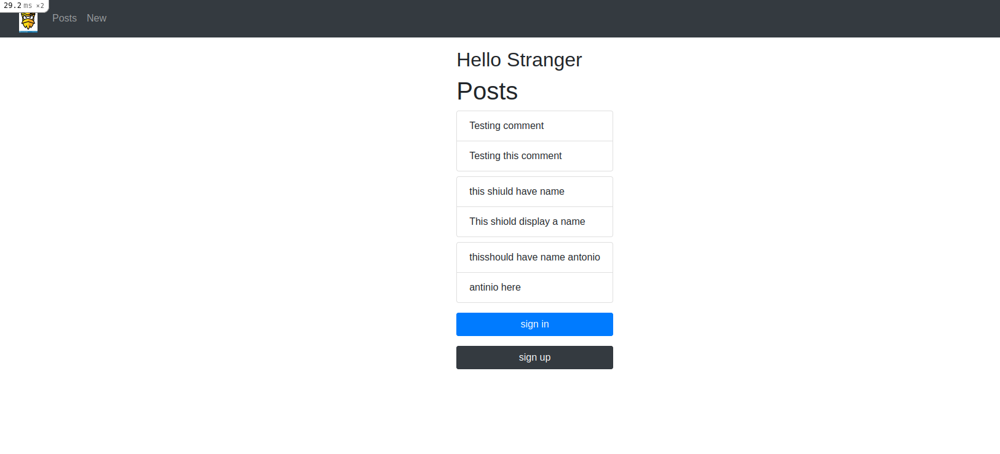

# Authentication

## Table of Contents
  <br />

* [Live version](https://apple-custard-88947.herokuapp.com/)
* [About the Project](#about-the-project)
* [Built With](#built-with)
* [Contributing](#contributing)
* [Contact](#authors)
* [Acknowledgements](#acknowledgements) 

#
<br />

[](https://forthebadge.com) </br>


<br />

#


<!-- ABOUT THE PROJECT   -->
## About The Project

The Authentication project sets up an initial rails app that allows users to sign in, and post comments. The only user who is signed in can see the Comments Author.

## Screenshot Test
#
<p align="center">
  
</p>

#

### Built With

* [RUBY]
* [RAILS]
* [Devise]

## Contributing

Contributions make the open-source community such an amazing place to learn, inspire, and create. Any contributions you make are **greatly appreciated**.

## Prerequisite

Ruby & Rails installed on your local machine.
bundle installed on your machine
Terminal or similar to execute the program.


## Getting Started


## Clone project

- To get a local copy up and running follow these simple example steps.
- Clone this repository with git clone ```https://github.com/sergiocortessat/Rails_Authentication.git``` using your terminal or command line.
- Change to the project directory by entering: ```cd Rails_Authentication``` in the terminal.


## How to use the Authentication app
1. run the command ```bundle install```   This will install the required dependencies
2. run the command ```rails db:create```. This will initialize the necessary migration files
3. run the command ```rails db:migrate``` 
4. run the command ```rails server```


## Authors

👤 Sergio Cortes Satizabal

- Github: [@sergiocortessat](https://github.com/sergiocortessat)
- Twitter: [@sergiocortessat](https://twitter.com/sergiocortessat)
- LinkedIn: [@sergiocortessat](www.linkedin.com/in/sergio-cortes-satizabal-3b452194)

👤 

- Github: [@nganifaith](https://github.com/nganifaith)
- Twitter: [@nganifaith](https://twitter.com/Bright_Ngani)
- LinkedIn: [@nganifaith](https://www.linkedin.com/in/ngani-faith/)


Project Link: [Rails-Authentication](https://github.com/sergiocortessat/Rails_Authentication/issues/1)


<!-- ACKNOWLEDGEMENTS -->
## Acknowledgements

* [Microverse](https://www.microverse.org/)

## 📝 License

This project is [MIT](https://github.com/sergiocortessat/sergiocortessat/blob/main/LICENSE) licensed.


